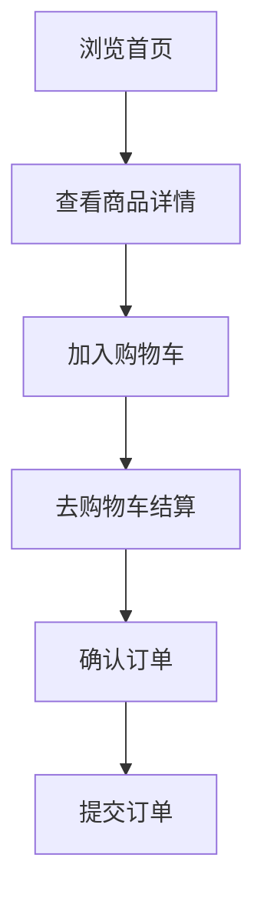
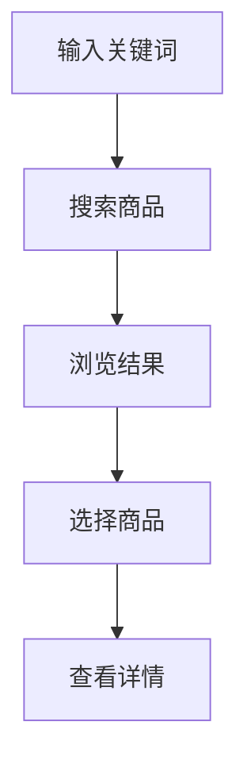

# 仿淘宝App产品需求文档

## 1. 产品概述

仿淘宝是一款移动端购物应用，旨在为用户提供便捷的商品浏览、搜索、购物车管理和下单功能。应用采用卡片式布局，色彩鲜明，操作流畅，让用户享受类似原生App的体验。

## 2. 核心功能

### 2.1 用户角色
| 角色 | 注册方式 | 核心权限 |
|------|----------|----------|
| 访客用户 | 无需注册 | 浏览商品、搜索、使用购物车（本地存储） |
| 登录用户 | 手机号登录 | 所有功能+订单管理 |

### 2.2 功能模块
1. **首页**：轮播图、分类导航、推荐商品列表
2. **分类页**：商品分类浏览、筛选
3. **购物车**：商品管理、数量修改、结算
4. **我的**：用户信息、订单列表
5. **商品详情**：商品信息展示、加入购物车

### 2.3 页面详情
| 页面名称 | 模块名称 | 功能描述 |
|----------|----------|----------|
| 首页 | 轮播图 | 自动轮播展示促销活动 |
| 首页 | 分类导航 | 9宫格快速分类入口 |
| 首页 | 推荐商品 | 瀑布流商品展示 |
| 分类页 | 分类列表 | 左右联动分类浏览 |
| 购物车 | 商品列表 | 多选、删除、数量调整 |
| 我的 | 用户信息 | 头像、昵称、会员等级 |
| 我的 | 订单入口 | 待付款、待发货、待收货、已完成 |
| 商品详情 | 商品信息 | 图片、价格、描述、规格 |
| 商品详情 | 购物操作 | 加入购物车、立即购买 |

## 3. 核心流程

### 3.1 购物流程

### 3.2 搜索流程

## 4. 用户界面设计

### 4.1 设计风格
- **主色调**：橙色 (#FF6600) - 代表活力与购物热情
- **辅助色**：深红色 (#DC143C) - 用于强调和促销
- **背景色**：浅灰色 (#F5F5F5) - 页面背景
- **卡片色**：白色 (#FFFFFF) - 内容卡片
- **文字色**：深灰色 (#333333) - 主要文字
- **按钮风格**：圆角按钮，橙色主按钮

### 4.2 页面设计概览
| 页面 | 模块 | UI元素 |
|------|------|--------|
| 首页 | 顶部搜索栏 | 搜索图标、输入框 |
| 首页 | 轮播图 | 全宽图片、自动轮播指示器 |
| 首页 | 分类导航 | 3x3图标网格 |
| 首页 | 商品卡片 | 图片、标题、价格、销量 |
| 分类页 | 左侧分类 | 垂直列表、选中高亮 |
| 分类页 | 右侧商品 | 2列网格布局 |
| 购物车 | 商品项 | 复选框、图片、标题、价格、数量控件 |
| 商品详情 | 图片展示 | 横向滑动图片 |
| 商品详情 | 价格区域 | 现价、原价、促销标签 |
| 我的 | 用户卡片 | 头像、昵称、会员等级 |

### 4.3 响应式设计
- 移动端优先设计
- 触摸优化，按钮最小点击区域48dp
- 流畅的页面切换动画
