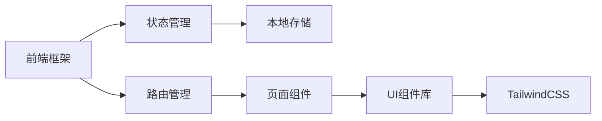

# 仿淘宝App技术架构文档

## 1. 架构设计



## 2. 技术选型

- **前端框架**：React@18 + Vite
- **移动框架**：Ionic React - 专业的移动端UI组件库
- **样式方案**：TailwindCSS@3
- **状态管理**：React Context
- **路由管理**：React Router v6
- **本地存储**：LocalStorage (购物车数据持久化)
- **图标库**：Ionicons

## 3. 路由定义

| 路由 | 页面 | 功能 |
|------|------|------|
| / | Tab-首页 | 轮播图、分类、推荐商品 |
| /category | Tab-分类 | 商品分类浏览 |
| /cart | Tab-购物车 | 购物车管理 |
| /mine | Tab-我的 | 用户中心 |
| /product/:id | 商品详情 | 商品信息展示 |
| /search | 搜索页 | 商品搜索 |

## 4. 页面组件结构

```
src/
├── pages/
│   ├── HomePage.tsx       # 首页
│   ├── CategoryPage.tsx   # 分类页
│   ├── CartPage.tsx       # 购物车
│   ├── MinePage.tsx       # 我的
│   ├── ProductPage.tsx    # 商品详情
│   └── SearchPage.tsx     # 搜索页
├── components/
│   ├── ProductCard.tsx    # 商品卡片
│   ├── CartItem.tsx       # 购物车商品项
│   ├── CategoryList.tsx   # 分类列表
│   └── Swiper.tsx         # 轮播组件
├── context/
│   └── CartContext.tsx    # 购物车状态管理
├── data/
│   └── products.ts        # 模拟商品数据
└── App.tsx                # 应用入口
```

## 5. 数据模型

### 5.1 商品模型
```typescript
interface Product {
  id: string;
  title: string;
  price: number;
  originalPrice: number;
  image: string;
  images: string[];
  sales: number;
  category: string;
  description: string;
}
```

### 5.2 购物车模型
```typescript
interface CartItem {
  product: Product;
  quantity: number;
  selected: boolean;
}
```

### 5.3 订单模型
```typescript
interface Order {
  id: string;
  items: CartItem[];
  total: number;
  status: 'pending' | 'paid' | 'shipped' | 'completed';
  createTime: string;
}
```

## 6. Android打包配置

使用 Capacitor 将React应用打包为Android APK：
- **Capacitor Core**: @capacitor/core
- **Capacitor CLI**: @capacitor/cli
- **Android平台**: @capacitor/android
- **状态栏插件**: @capacitor/status-bar
